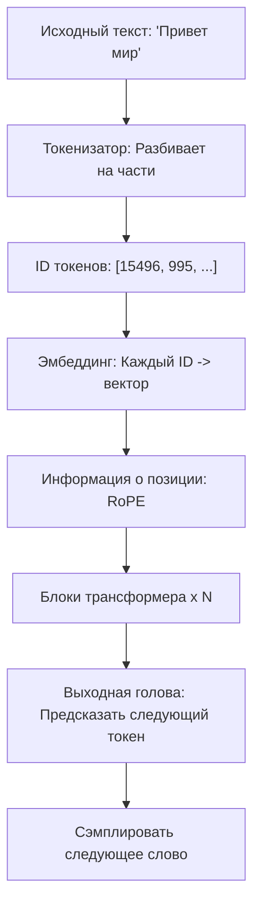

# Глава 0 — Что вообще такое GPT?

> *«Если вы можете объяснить это пятилетнему ребёнку, значит, вы действительно это понимаете.»*

---

## Аналогия для пятилетних

Представьте, что у вас есть друг, который прочитал **каждую книгу в библиотеке**. Вы начинаете предложение:

> *«Кот сидел на...»*

Ваш друг, прочитав столько книг, **угадывает** следующее слово: **«ковре»**.

Вот и всё, чем является GPT: **машина, которая читает тонны текста и учится угадывать следующее слово.**

| Концепция | Аналогия |
|---|---|
| **GPT** | Очень умный «угадыватель следующих слов» |
| **Обучение** | Чтение миллионов книг для изучения паттернов |
| **Генерация текста** | Бесконечная игра «закончи моё предложение» |
| **Параметры** | «Память» всех выученных паттернов |
| **Внимание** | Знание того, какие слова важнее всего |

## Общая картина: Обзор конвейера

## На каких моделях это основано?

**Короткий ответ: Это современный декодер-трансформер (в стиле LLaMA), включающий лучшие общедоступные документированные техники 2023-2025 годов.**

## Что вы построите

К концу этого руководства вы создадите с нуля:

| Компонент | Что делает | Глава |
|---|---|---|
| **Токенизатор** | Преобразует текст ↔ числа (BPE, тот же алгоритм, что у GPT-4) | [2](02_tokenization.md) |
| **Эмбеддинги** | Даёт каждому токену 768-мерный «вектор смысла» | [3](03_embeddings.md) |
| **RoPE** | Учит модель порядку слов через вращение | [4](04_positional_encoding.md) |
| **Внимание** | Позволяет словам «смотреть на» и «общаться с» друг другом | [5](05_attention.md) |
| **Блок трансформера** | Полная мыслительная единица: внимание + feed-forward + остаточные связи | [6](06_transformer_block.md) |
| **Модель GPT** | Полная языковая модель на 151 млн параметров (с SwiGLU) | [7](07_gpt_model.md) |
| **Конвейер обучения** | Загрузка данных, AdamW, косинусное расписание, смешанная точность | [8](08_training.md) |
| **Движок вывода** | Генерация текста с температурой, top-k, top-p, KV-кэшем | [9](09_inference.md) |
| **Полный скрипт** | Один файл, который обучает и генерирует — запускается от начала до конца | [10](10_full_script.md) |

**Для кого это?** Любой, кто знает основы Python. Опыт ML/AI не нужен. Каждая концепция объясняется сначала через аналогии, затем математика, затем код с комментариями.

**Что вам понадобится:** Компьютер с Python 3.10+. GPU желателен, но не обязателен — мы предоставляем крошечную конфигурацию, которая работает на CPU.

## На каких моделях это основано? (Технически)

| Техника | Исходная модель | Публично подтверждено? |
|---|---|---|
| Декодер-трансформер | GPT-2 (2019), GPT-3 (2020) | Да |
| Пре-норм остаточная | GPT-3 (2020) | Да |
| BPE токенизатор | GPT-2/3/4 | Да |
| Оптимизатор AdamW | GPT-3 (2020) | Да |
| Косинусная LR + разогрев | GPT-3 (2020) | Да |
| Связывание весов | GPT-2/3 | Да |
| **RoPE** (позиционное кодирование) | **LLaMA, Mistral, Qwen** | Да — НЕ GPT-3/4 |
| **RMSNorm** (нормализация) | **LLaMA, Mistral, Gemma** | Да — НЕ GPT-3/4 |
| **SwiGLU** (активация) | **PaLM, LLaMA, Gemini** | Да — НЕ GPT-3 |
| Смешанная точность (bfloat16) | Все современные модели | Да |

**А как насчёт GPT-4 и Claude?** Их архитектуры являются **собственными и нераскрытыми**. Мы знаем, что GPT-4 — это трансформер, но не знаем, какое позиционное кодирование, нормализацию или активацию он использует. Архитектура Claude полностью секретна.

**Чему учит это руководство:** Самой продвинутой **общедоступной документированной** архитектуре — по сути тому, что используют **LLaMA 3, Mistral, Qwen 2.5 и Gemma**. Это архитектура, лежащая в основе лучших моделей с открытым исходным кодом, и представляет собой современное состояние искусства, которое у нас действительно есть подтверждённая документация для.

**Что делает модель «мирового класса»?**

1. **Масштаб** — миллиарды параметров, обученные на триллионах токенов
2. **Архитектура** — современный трансформер (наш фокус)
3. **Качество данных** — чистый, разнообразный, хорошо отфильтрованный текст
4. **Трюки обучения** — смешанная точность, обрезка градиентов, расписания LR

> Мы построим крошечную версию, используя **те же общедоступные документированные техники**, что и лучшие модели с открытым исходным кодом.

---

**Далее:** [Глава 1 — Настройка и инструменты](01_setup.md)
