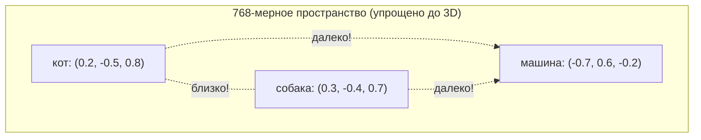

# Глава 3 — Эмбеддинги: Придание числам смысла

## Аналогия для пятилетних

Представьте, что каждое слово живёт в **гигантском многоквартирном доме** с 768 этажами (измерениями).

- **«Кот»** живёт на 3-м этаже восточного крыла, 15-м этаже северного и т.д.
- **«Собака»** живёт поблизости — на похожих этажах, потому что они оба животные.
- **«Машина»** живёт далеко — совершенно другие этажи.

У каждого слова есть **координата** в этом здании. Слова со схожим смыслом имеют близкие координаты. Вот что такое эмбеддинг: **координата слова в пространстве смыслов.**



## Знаменитая аналогия «Король - Мужчина + Женщина = Королева»

Это самый известный пример того, что могут_capture эмбеддинги:

```python
# В хорошо обученном пространстве эмбеддингов:
# embedding("king") - embedding("man") + embedding("woman")
# ≈ embedding("queen")
```

**Почему это работает?** «Король» имеет два компонента в пространстве смыслов:
- Царственность (общее с «королева», «принц», «трон»)
- Мужественность (общее с «мужчина», «он», «мальчик»)

Вычитание «мужчины» удаляет компонент мужественности. Добавление «женщины» добавляет женственность. Результат: вектор, означающий «царственность + женственность» = «королева».

Это не запрограммировано — это **возникает естественно** из математики обучения. Модель узнаёт, что изменение пола при сохранении смысла создаёт согласованное «направление» в пространстве эмбеддингов.

## Как ИЗУЧАЮТСЯ эмбеддинги

Это самый важный вопрос: «Если эмбеддинги начинаются случайными, как они становятся осмысленными?»

### Шаг 1: Случайная инициализация

Когда мы создаём модель, каждая строка эмбеддинга — случайный шум:
```
Токен 9246 («кот»): [0.002, -0.013, 0.007, ..., -0.009]   (768 случайных чисел)
Токен 6734 («сидел»): [0.015, 0.001, -0.011, ..., 0.004]   (768 случайных чисел)
```

В этот момент «кот» и «собака» **не ближе** друг к другу, чем «кот» и «the». Модель ничего не знает.

### Шаг 2: Сигнал обучения

Во время обучения модель видит: `"The cat sat on the mat"` и пытается предсказать следующее слово.

Когда она ошибается насчёт «mat» (предсказывая «dog» вместо него), **loss** высок. Backpropagation отправляет сигнал:
- «Эмбеддинг для 'cat' должен быть обновлён, чтобы он лучше предсказывал 'mat'»
- «Эмбеддинг для 'mat' должен быть ближе к вещам, которые следуют за 'the'»

### Шаг 3: Градиентный спуск обновляет эмбеддинги

```python
# Упрощённо — что происходит с одним эмбеддингом за один шаг обучения:

# Текущий эмбеддинг для токена «кот»:
cat_embedding = [0.002, -0.013, 0.007, ..., -0.009]

# После видения «The ___ sat on the mat» (заполняя «cat»):
# Градиент говорит: «подними измерение 5 на 0.0003, опусти измерение 42 на 0.0001...»
cat_embedding = [0.002, -0.012, 0.008, ..., -0.010]  # Крошечное обновление

# После МИЛЛИОНОВ примеров возникают паттерны:
# - «кот» перемещается близко к «собака», «питомец», «кошачий»
# - «кот» остаётся далеко от «машина», «демократия», «фотосинтез»
```

### Шаг 4: После обучения — возникающая структура

После обучения на миллиардах токенов, 768-мерное пространство развивает осмысленную структуру:

```
Направление 1 (0-63):   Одушевлённость — живое vs неживое
Направление 2 (64-127): Размер — большой vs маленький  
Направление 3 (128-191): Тональность — позитивная vs негативная
Направление 4 (192-255): Формальность — формальная vs неформальная
...
```

Эти «направления» не назначаются людьми. Они возникают из геометрии языка. Модель обнаруживает, что полезно кластеризовать связанные концепции вместе, потому что они появляются в схожих контекстах.

## Примечание о масштабировании

GPT-2 и GPT-3 умножают эмбеддинги на `sqrt(d_model)`. Это нужно,
когда вы ДОБАВЛЯЕТЕ позиционные кодирования к эмбеддингам, потому что два сигнала
должны иметь сопоставимую величину. Значения позиции от sin/cos находятся между
-1 и 1, в то время как свежеинициализированные эмбеддинги намного меньше.

Мы используем RoPE вместо этого. RoPE не добавляет информацию о позиции. Он вращает
векторы запроса и ключа. Вращение сохраняет величину вектора, поэтому нет
проблемы с тем, что один сигнал заглушает другой. Следуя соглашению LLaMA,
мы не применяем никакого масштабирования к эмбеддингам в нашем коде.
Слой эмбеддинга просто извлекает вектор и возвращает его.

```python
embeddings = self.embed(x)           # Значения ~N(0, 0.02) из инициализации
# Масштабирование не нужно с RoPE — LLaMA и Mistral не масштабируют эмбеддинги
```

## Что определяет качество эмбеддингов?

| Фактор | Хорошие эмбеддинги | Плохие эмбеддинги |
|---|---|---|
| Объём данных обучения | 100B+ токенов | 1M токенов |
| Размерность эмбеддинга | 768+ (GPT-2) до 12288 (GPT-3) | 64 или меньше |
| Размер словаря | 50K (сбалансировано) | 5K (слишком мало) или 500K (слишком редко) |
| Длительность обучения | Сходящийся loss | Ранняя остановка |
| Разнообразие данных | Книги, веб, код, разговоры | Одна область |

## Код эмбеддинга — с комментариями

```python
import torch
import torch.nn as nn
import math


class Embedding(nn.Module):
    """
    ЧТО: Преобразует ID токенов в плотные векторы (эмбеддинги).
    ЗАЧЕМ: Нейронная сеть не может делать осмысленную математику с целочисленными ID
         вроде [9246, 6734]. Ей нужны непрерывные числа в векторах.

         Представьте это как гигантскую таблицу поиска:
         Строка 9246 -> вектор из 768 float (смысл «кота»)
         Строка 6734 -> вектор из 768 float (смысл «сидел»)

         Эта таблица ИЗУЧАЕТСЯ. Изначально случайная, backpropagation
         постепенно перемещает связанные токены ближе друг к другу в
         768-мерном пространстве.
    """

    def __init__(self, vocab_size: int, d_model: int):
        """
        ЧТО: Создаёт таблицу эмбеддингов (обучаемую матрицу).

        Аргументы:
            vocab_size: Сколько уникальных токенов существует (50,257 для GPT-2)
            d_model:    Размер каждого вектора эмбеддинга.

        Примеры по масштабу модели:
            GPT-2 small:  vocab=50257, d_model=768   → таблица 50257 × 768
            GPT-2 medium: vocab=50257, d_model=1024  → таблица 50257 × 1024
            GPT-3 small:  vocab=50257, d_model=4096  → таблица 50257 × 4096
            GPT-3 large:  vocab=50257, d_model=12288 → таблица 50257 × 12288

        ЗАЧЕМ: Размерность эмбеддинга определяет, сколько «пространства»
             имеет каждое слово для выражения своего смысла. Больший d_model =
             более нюансированные смыслы могут быть захвачены, ценой
             большего количества параметров и более медленного обучения.
        """
        super().__init__()

        # ЧТО: Фактические веса эмбеддинга — матрица [vocab_size, d_model]
        # ЗАЧЕМ: nn.Embedding — оптимизированная таблица поиска. Когда вы передаёте
        #      тензор ID токенов, он возвращает соответствующие строки.
        #      Он поддерживается стандартной матрицей весов, поэтому градиенты
        #      протекают через него так же, как через любой слой nn.Linear.
        #
        #      Внутри nn.Embedding по сути:
        #      def forward(self, x):
        #          return self.weight[x]  # индексация в матрице весов
        self.embed = nn.Embedding(vocab_size, d_model)

    def forward(self, x: torch.Tensor) -> torch.Tensor:
        """
        ЧТО: Извлекает эмбеддинги для каждого ID токена во входных данных.

        Форма входа:  [batch_size, seq_len]    — каждая ячейка — ID токена
        Форма выхода: [batch_size, seq_len, d_model] — каждая ячейка — вектор

        Пример прохождения:
            Вход:  [[464, 3797]]              # ["The", "cat"]
            Шаг 1: Извлечь строку 464 → [768 float] для "The"
                   Извлечь строку 3797 → [768 float] для "cat"
            Шаг 2: Масштабировать на sqrt(768) ≈ 27.7
            Выход: [[[v0..v767], [v0..v767]]] # 2 вектора из 768 чисел

        ЗАЧЕМ каждое измерение:
            batch_size = сколько последовательностей мы обрабатываем одновременно (параллелизм)
            seq_len    = сколько токенов на последовательность (окно контекста)
            d_model    = насколько богато представление каждого токена (выразительность)
        """
        # ЧТО: Индексация в матрице эмбеддинга
        # ЗАЧЕМ: Для каждого ID токена вернуть его строку. Это O(1)
        #      операция поиска — очень быстрая, даже для словаря 50K+.
        embeddings = self.embed(x)  # [batch, seq_len, d_model]

        # ЧТО: Вернуть эмбеддинги без изменений
        # ЗАЧЕМ: Мы используем RoPE для кодирования позиции. RoPE вращает, а не
        #      добавляет, поэтому масштабирование не нужно. LLaMA и Mistral
        #      следуют этому же соглашению.
        return embeddings
```

## Быстрый тест на понимание

Прежде чем двигаться дальше, проверьте своё понимание:

1. **В:** Если «cat» — токен 9246, что такое эмбеддинг «cat»?
   **О:** Whatever row 9246 of the embedding matrix contains. Изначально случайный, после обучения это 768-мерный вектор, захватывающий «смысл» «cat».

2. **В:** Почему мы не можем использовать сырые ID токенов (9246, 6734 и т.д.) напрямую?
   **О:** Потому что 9246 и 6734 — просто произвольные числа. Модель бы подумала, что 9246 > 6734 (ложная связь). Эмбеддинги позволяют модели узнать, что «cat» (9246) похож на «dog» (не соседний ID, а соседний вектор).

3. **В:** Захватывают ли эмбеддинги смысл для пунктуации тоже?
   **О:** Да! «.» (точка), «,» (запятая), «?» все имеют эмбеддинги. Модель узнаёт, что за «.» следуют слова с заглавной буквы, за «?» следуют ответы и т.д.

---

**Предыдущая:** [Глава 2 — Токенизация](02_tokenization.md)
**Следующая:** [Глава 4 — Позиционное кодирование](04_positional_encoding.md)
