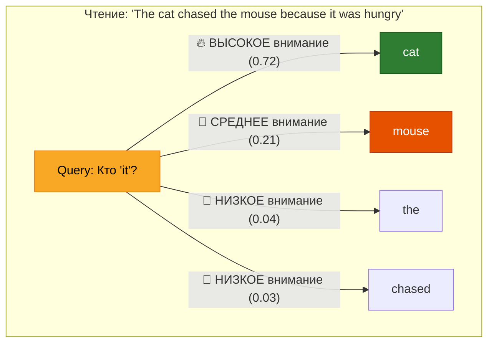
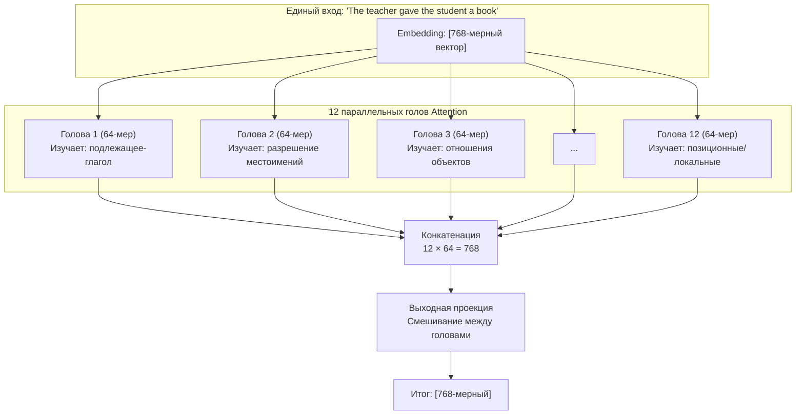
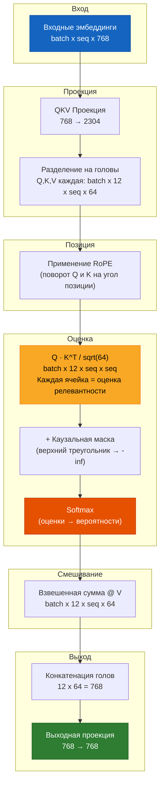

# Глава 5 — Attention: Секретный ингредиент

> *Attention — это не просто часть Transformer. Attention — это и есть Transformer.*

## Аналогия для пятилетнего ребёнка

Вы заходите на многолюдную вечеринку. Вы хотите понять, что происходит. Вы не слушаете **всех одинаково**. Вы уделяете **больше внимания**:

- Человеку, с которым разговариваете (высокая релевантность)
- Человеку, который громко кричит (высокая важность)
- Разговору о вашей любимой теме (высокое соответствие вашим интересам)

**Attention — это способность модели смотреть на ВСЕ слова и решать: «Насколько сильно мне важно это слово ПРЯМО СЕЙЧАС?»**



---

## Часть 1: Self-Attention — Основная идея

### Проблема, которую это решает

Рассмотрим предложение: **"The cat sat on the mat because it was warm."**

К чему относится **"it"**? К коту? К коврику? Человек мгновенно понимает: "it" = "mat" (потому что коврики бывают тёплыми, а коты — теплокровные). Но как компьютер может это определить?

**До attention (RNN, LSTM):** Слова обрабатывались по одному, слева направо. К моменту, когда модель доходила до "it", слово "mat" было уже далеко в прошлом — его информация затухла.

**С attention:** Модель может одновременно посмотреть на ВСЕ предыдущие слова и решить: "mat" лучше всего соответствует "it", потому что "warm" часто ассоциируется с поверхностями/объектами.

### Что вычисляет Self-Attention

Для каждого слова в последовательности self-attention создаёт **новое представление** этого слова, которое является **взвешенной смесью всех слов в последовательности**:

```
New("it") = 0.72 × cat + 0.21 × mouse + 0.04 × the + 0.03 × chased
```

Веса (0.72, 0.21, 0.04, 0.03) — это **оценки attention** — они показывают, насколько важно каждое слово.

---

## Часть 2: Математика — От слов к оценкам Attention

### Пошаговый рабочий пример

Давайте проследим работу attention на **реальных (упрощённых) числах**. Для ясности используем крошечную модель с `d_model=4` и `num_heads=2`.

**Вход:** Предложение `"I love dogs"` после токенизации и эмбеддинга:
```
Token 0 ("I"):    [0.5,  0.2, -0.3,  0.8]
Token 1 ("love"): [0.1, -0.5,  0.7, -0.2]
Token 2 ("dogs"): [0.9,  0.3, -0.1, -0.5]
```

### Шаг 1: Создание Q, K, V из входа

Эмбеддинг каждого токена умножается на три весовые матрицы, создавая векторы Query, Key и Value:

```
Q = x × W_q    (Query: «Что я ищу?»)
K = x × W_k    (Key:   «Что я могу предложить?»)
V = x × W_v    (Value: «Моё фактическое содержание/информация»)
```

Эти весовые матрицы `W_q, W_k, W_v` **изучаются во время обучения**. Изначально случайные, они постепенно учатся проецировать токены в полезные пространства Q/K/V.

Для нашего крошечного примера, скажем, после проекции (с `head_dim=2`):

```
Token │ Query (Q)    │ Key (K)      │ Value (V)
──────┼───────────────┼──────────────┼──────────────
 0:"I"   │ [ 0.8,  0.1] │ [ 0.6, -0.3] │ [ 0.4,  0.9]
 1:"love"│ [-0.2,  0.7] │ [ 0.1,  0.5] │ [-0.3,  0.2]
 2:"dogs"│ [ 0.5, -0.4] │ [-0.4,  0.8] │ [ 0.7, -0.1]
```

### Шаг 2: Вычисление оценок Attention

Оценка attention между токеном `i` (query) и токеном `j` (key) — это **скалярное произведение**:

```
score(i→j) = Q_i · K_j
```

Это показывает, насколько хорошо query токена `i` совпадает с key токена `j`. Высокое скалярное произведение = высокая релевантность.

**Вычисляем оценки для токена 2 ("dogs"), смотрящего на все токены:**

```
score("dogs"→"I")    = Q₂ · K₀ = [0.5, -0.4] · [ 0.6, -0.3] = 0.30 + 0.12 = 0.42
score("dogs"→"love") = Q₂ · K₁ = [0.5, -0.4] · [ 0.1,  0.5] = 0.05 - 0.20 = -0.15
score("dogs"→"dogs") = Q₂ · K₂ = [0.5, -0.4] · [-0.4,  0.8] = -0.20 - 0.32 = -0.52
```

### Шаг 3: Масштабирование оценок

Делим на `sqrt(head_dim)` = `sqrt(2)` ≈ 1.414:

```
Зачем? Если d_k велико, скалярные произведения становятся большими числами.
Большие числа → softmax становится очень «пикообразным» (одно значение около 1.0,
остальные около 0.0) → градиенты затухают → модель перестаёт учиться.

Масштабирование сохраняет дисперсию на уровне 1.0 независимо от d_k.
```

```
Масштабированные оценки: [0.42/1.414, -0.15/1.414, -0.52/1.414] = [0.297, -0.106, -0.368]
```

### Шаг 4: Применение каузальной маски (только при обучении)

Во время обучения токен на позиции `i` не может видеть токены на позициях `> i`. Это означает:

```
Для токена 0 ("I"):    может видеть только позицию 0
Для токена 1 ("love"): может видеть только позиции 0, 1
Для токена 2 ("dogs"): может видеть только позиции 0, 1, 2
```

Будущие позиции устанавливаются в `-infinity` (чтобы их softmax стал 0).

### Шаг 5: Softmax → Веса Attention

Преобразуем оценки в вероятности, суммирующиеся в 1:

```
softmax([0.297, -0.106, -0.368]) = [0.53, 0.35, 0.12]
```

**Интерпретация:** При обработке "dogs" модель уделяет:
- 53% внимания "I"
- 35% внимания "love"
- 12% внимания "dogs" (самому себе)

### Шаг 6: Взвешенная сумма Value

Умножаем вектор value каждого токена на его вес attention и суммируем:

```
New("dogs") = 0.53 × V("I") + 0.35 × V("love") + 0.12 × V("dogs")

            = 0.53 × [ 0.4,  0.9] + 0.35 × [-0.3,  0.2] + 0.12 × [ 0.7, -0.1]
            = [0.212, 0.477]      + [-0.105, 0.070]      + [0.084, -0.012]
            = [0.191, 0.535]
```

**Этот новый вектор [0.191, 0.535] — это «контекстно-зависимое» представление "dogs"** — теперь оно содержит информацию от "I" и "love", взвешенную по релевантности.

### Полная матрица Attention

Для нашей последовательности из 3 токенов полная матрица весов attention:

```
         │ "I"    "love"  "dogs"  ← (keys: «что я предлагаю»)
─────────┼──────────────────────
"I"      │ 1.00   0.00    0.00    ← "I" видит только себя (каузальность)
"love"   │ 0.45   0.55    0.00    ← "love" видит "I" и себя
"dogs"   │ 0.53   0.35    0.12    ← "dogs" видит все три
    ↑
(queries: «что я ищу»)
```

Это **каузальная структура attention** — нижнетреугольная матрица, где каждая строка суммируется в 1.0. Каждый токен строит своё представление из себя и всех предыдущих токенов.

---

## Часть 3: Multi-Head Attention — Зачем несколько голов?

### Ограничение одной головы

С одной головой внимания модель усредняет ВСЕ отношения в одно представление. Но в языке много одновременных отношений:

```
"The teacher gave the student a book because she was proud of him."

В: Кто "she"?  → teacher (согласование по роду)
В: Кто "him"?   → student (согласование по роду)
В: Кто что дал?   → teacher → student → book (синтаксические роли)
```

Одна голова должна сжать все три ответа в один вектор — беспорядочно, с потерями, путаницей.

### Multi-Head: Разделяй и властвуй

Вместо этого мы запускаем attention **несколько раз параллельно**, каждый со своими `W_q, W_k, W_v`:

```
Голова 1 изучает: связи подлежащее-глагол → "teacher" ↔ "gave"
Голова 2 изучает: разрешение местоимений  → "she" ↔ "teacher"
Голова 3 изучает: отношения объектов     → "student" ↔ "book"
Голова 4 изучает: шаблоны прил-сущ       → "proud" ↔ "teacher"
...
Голова 12: позиционные шаблоны, пунктуация и т.д.
```

Каждая голова имеет размерность `d_model / num_heads`. Для GPT-2 small: `768 / 12 = 64` измерения на голову.



### Что на самом деле изучают головы (из исследований)

Анализ обученных моделей GPT-2 выявляет специализацию голов:

- **Ранние слои (1-3):** Локальный синтаксис — соседние слова, пунктуация, базовая грамматика
- **Средние слои (4-8):** Семантические отношения — подлежащее-глагол, отношения объектов, отслеживание сущностей
- **Поздние слои (9-12):** Высокоуровневые шаблоны — связность темы, область отрицания, разрешение анафоры

Некоторые головы становятся узкоспециализированными:
- «Головы дублирования токенов»: Копируют предыдущий токен (полезно для повторений)
- «Головы подавления»: Активно подавляют внимание к определённым токенам
- «Позиционные головы»: Обращают внимание чисто по расстоянию (слово N позиций назад)

---

## Часть 4: Коэффициент масштабирования — Критическая деталь

### Зачем `1/sqrt(d_k)`?

Формула attention:

```
Attention(Q, K, V) = softmax(QK^T / √d_k) × V
```

Но зачем делить на `√d_k`? Давайте проследим математику:

**Без масштабирования:** Каждый элемент `QK^T` — это скалярное произведение двух векторов длины `d_k`. Если каждый элемент Q и K имеет среднее 0 и дисперсию 1, то:

```
Var(scalar product) = d_k
```

Таким образом, при `d_k = 64` скалярные произведения имеют дисперсию 64. Стандартное отклонение = 8. Это означает, что типичные скалярные произведения находятся в диапазоне от -24 до +24.

**Проблема:** Когда числа такие большие, `softmax` становится чрезвычайно пикообразным — одно значение приближается к 1.0, а все остальные — к 0.0. Градиент softmax почти везде равен нулю, поэтому модель перестаёт учиться.

**С масштабированием:** После деления на `√64 = 8` дисперсия становится 1.0. Скалярные произведения находятся в диапазоне от -3 до +3. Softmax даёт более гладкое распределение, и градиенты текут правильно.

```
Без масштабирования:  softmax([24, 8, -16]) = [0.99999988, 0.00000011, 0.00000000]  ← бесполезно!
С масштабированием:   softmax([3, 1, -2])   = [0.88, 0.12, 0.01]                    ← полезно!
```

---

## Часть 5: Каузальное маскирование — Не подглядывать в будущее

### Проблема

Во время обучения мы показываем модели: `"The cat sat on the mat"`

Задача модели на позиции 3 (`"on"`) — предсказать `"the"`. Но если позиция 3 может обращаться к позиции 5 (`"mat"`), модель может **смошенничать** — она видит ответ до предсказания!

### Решение: Нижнетреугольная маска

```
         │ pos0  pos1  pos2  pos3  pos4
─────────┼─────────────────────────────
pos0     │  ✓     ✗     ✗     ✗     ✗    "The" видит только себя
pos1     │  ✓     ✓     ✗     ✗     ✗    "cat" видит "The" и себя
pos2     │  ✓     ✓     ✓     ✗     ✗    "sat" видит первые три
pos3     │  ✓     ✓     ✓     ✓     ✗    "on"  видит первые четыре
pos4     │  ✓     ✓     ✓     ✓     ✓    "the" видит все пять
```

Реализация: установить верхний треугольник в `-infinity` → после softmax эти позиции становятся 0.0.

```python
# До маски:
attn_scores = [[0.3,  0.5,  0.2, -0.1, -0.4],  # строка 0
               [0.1,  0.4, -0.3,  0.6, -0.2],  # строка 1
               ...]

# Применяем маску (верхний треугольник = -inf):
attn_scores = [[0.3, -inf, -inf, -inf, -inf],  # строка 0: видит только поз. 0
               [0.1,  0.4, -inf, -inf, -inf],  # строка 1: видит 0,1
               [0.5, -0.2,  0.3, -inf, -inf],  # строка 2: видит 0,1,2
               ...]

# После softmax:
attn_weights = [[1.0,  0.0,  0.0,  0.0,  0.0],  # строка 0: весь вес на себе
                [0.43, 0.57, 0.0,  0.0,  0.0],  # строка 1: разделён между 0,1
                [0.42, 0.21, 0.37, 0.0,  0.0],  # строка 2: взвешенная смесь
                ...]
```

### Во время инференса

При генерации текста каузальное маскирование **поддерживается неявно** — мы генерируем токены по одному, поэтому будущих токенов просто ещё не существует. Текущий токен может обращаться только к ранее сгенерированным токенам.

---

## Часть 6: Вычислительная сложность — Проблема O(n²)

### Почему длинный контекст — это сложно

Attention вычисляет `Q @ K^T`, создавая матрицу размера `[seq_len × seq_len]`:

| Длина последовательности | Размер матрицы Attention | Память (float32) |
|---|---|---|
| 1,024 (GPT-2) | 1,024 × 1,024 | 4 МБ |
| 2,048 (GPT-3) | 2,048 × 2,048 | 16 МБ |
| 8,192 (LLaMA 2) | 8,192 × 8,192 | 256 МБ |
| 32,768 (GPT-4 Turbo) | 32,768 × 32,768 | 4 ГБ |
| 128,000 (Claude 3) | 128K × 128K | 64 ГБ |
| 1,000,000 (Gemini) | 1M × 1M | 4 ТБ |

Этот квадратичный рост — **фундаментальное узкое место** моделей Transformer.

### Решения

| Метод | Как работает | Ускорение |
|---|---|---|
| **Flash Attention** | Оптимизация паттернов доступа к памяти, слияние ядер | 2-4x |
| **Sparse Attention** | Обращение только к √n токенам (локальные + глобальные) | 10-100x |
| **Sliding Window** | Обращение только к последним W токенам (Mistral) | Линейное O(n) |
| **Ring Attention** | Разделение последовательности между GPU в кольце | Масштабируется с GPU |
| **Mamba/SSMs** | Полная замена attention моделями пространства состояний | Линейное O(n) |

Большинство современных LLM используют **Flash Attention** (Dao et al., 2022), который не меняет математику — он просто делает вычисления и доступ к памяти гораздо более эффективными через слияние ядер и тайлинг.

---

## Часть 7: Полный код Multi-Head Attention

```python
import torch
import torch.nn as nn
import torch.nn.functional as F
import math


class MultiHeadAttention(nn.Module):
    """
    ЧТО: Multi-Head Self-Attention с RoPE и каузальным маскированием.

    ЗАЧЕМ: Transformers были бы бесполезны без attention. Это механизм,
         который позволяет каждому токену «смотреть» на каждый другой токен
         и решать, насколько каждый важен для понимания текущего контекста.

         Каждая голова attention:
         1. Проецирует вход в пространства Query, Key, Value
         2. Вычисляет Q·K^T / sqrt(d_k) → насколько хорошо каждый query совпадает с каждым key
         3. Применяет каузальную маску → не подглядывать в будущее
         4. Softmax → преобразует оценки в распределение вероятностей
         5. Взвешенная сумма Values → строит контекстно-зависимое представление

         Параллельное выполнение этого с несколькими головами позволяет каждой голове
         специализироваться на разных лингвистических шаблонах.
    """

    def __init__(self, d_model: int, num_heads: int, dropout: float = 0.1):
        """
        Аргументы:
            d_model:   Общая размерность эмбеддинга (например, 768 для GPT-2 small)
            num_heads: Количество параллельных голов attention (например, 12)
            dropout:   Вероятность случайного обнуления весов attention

        ЗАЧЕМ: d_model должно делиться на num_heads, потому что каждая голова
             работает с d_model/num_heads измерениями (64 для GPT-2 small).
             Эта стратегия разделения-и-конкатенации позволяет головам специализироваться,
             сохраняя общее количество параметров таким же, как у одной большой головы.
        """
        super().__init__()

        # ЧТО: Проверка, что головы равномерно делят размерность модели
        assert d_model % num_heads == 0, (
            f"d_model ({d_model}) должно делиться на num_heads ({num_heads}). "
            f"Это гарантирует, что каждая голова имеет одинаковую размерность."
        )

        self.d_model = d_model
        self.num_heads = num_heads
        self.head_dim = d_model // num_heads  # 768/12 = 64 измерения на голову
                                               # ЗАЧЕМ: 64 — это «золотая середина» —
                                               # достаточно для захвата смысла,
                                               # достаточно мало для эффективных вычислений

        # ===== Проекция QKV =====
        # ЧТО: Один большой линейный слой, который одновременно проецирует вход в Q, K, V
        # ЗАЧЕМ: 3 отдельных слоя Linear(768→768) = 3 умножения матриц.
        #       Один комбинированный Linear(768→2304) = 1 большее умножение матрицы.
        #       На GPU 1 большая операция намного быстрее, чем 3 маленькие,
        #       благодаря лучшему параллелизму и меньшему количеству запусков ядер.
        #       Форма: [d_model, 3 * d_model] = [768, 2304]
        self.qkv_proj = nn.Linear(d_model, 3 * d_model, bias=False)

        # ===== Выходная проекция =====
        # ЧТО: Проекция конкатенированных выходов голов обратно в d_model
        # ЗАЧЕМ: После конкатенации: [batch, seq, d_model], но выход каждой головы
        #       вычислялся независимо. Этот линейный слой СМЕШИВАЕТ информацию
        #       между головами, позволяя им общаться.
        #       Без него головы оставались бы изолированными — как 12 экспертов,
        #       которые никогда не разговаривают друг с другом.
        self.out_proj = nn.Linear(d_model, d_model, bias=False)

        # ===== RoPE (Rotary Position Embeddings) =====
        # ЧТО: Применяет позиционное кодирование на основе вращения только к Q и K
        # ЗАЧЕМ: RoPE кодирует позицию в векторы Q и K так, чтобы скалярное
        #       произведение Q·K естественным образом зависело от ОТНОСИТЕЛЬНОЙ позиции.
        #       Применяем к head_dim (не d_model), потому что каждой голове нужна
        #       своя информация о позиции в её подпространстве.
        #       V НЕ получает RoPE, потому что values несут содержание, а не позицию —
        #       позиция важна только для решения, КАКИЕ значения использовать,
        #       а не сами значения.
        self.rotary = RotaryPositionalEmbedding(self.head_dim)

        # ===== Dropout =====
        # ЧТО: Случайное обнуление весов attention во время обучения
        # ЗАЧЕМ: Без dropout модель может стать слишком уверенной —
        #       один токен всегда доминирует в attention, игнорируя другой
        #       потенциально полезный контекст. Dropout заставляет модель
        #       изучать избыточные паттерны attention (резервные планы).
        self.attn_dropout = nn.Dropout(dropout)   # Применяется к весам attention
        self.resid_dropout = nn.Dropout(dropout)  # Применяется к финальному выходу

    def forward(self, x: torch.Tensor, mask: torch.Tensor = None) -> torch.Tensor:
        """
        ЧТО: Вычисление multi-head self-attention.

        Вход:  x    [batch, seq_len, d_model]  — эмбеддинги токенов
               mask [batch, 1, seq, seq]       — каузальная маска (1=видимо, 0=замаскировано)

        Выход:     [batch, seq_len, d_model]  — контекстно-зависимые представления

        Forward pass состоит из 8 шагов, каждый критически важен:
        """
        batch_size, seq_len, _ = x.shape

        # ===== ШАГ 1: Проекция входа в Q, K, V — всё сразу =====
        # ЧТО: Линейное преобразование входа в пространства query, key, value
        # ЗАЧЕМ: Комбинированная проекция быстрее на GPU, чем 3 отдельные.
        #       После этого: [batch, seq, 3*d_model], где последнее измерение
        #       содержит сначала Q, затем K, затем V.
        qkv = self.qkv_proj(x)               # [batch, seq, 3 * d_model]

        # ===== ШАГ 2: Reshape для выделения размерности головы =====
        # ЧТО: Разделение 3*d_model на отдельные Q,K,V и отдельные головы
        # ЗАЧЕМ: Нужна форма [batch, num_heads, seq, head_dim] для
        #       параллельных вычислений. Reshape + permute делают это
        #       за две эффективные операции без копирования данных.
        #
        # Преобразование: [batch, seq, 3, heads, head_dim]
        # Затем permute: [3, batch, heads, seq, head_dim]
        qkv = qkv.reshape(batch_size, seq_len, 3, self.num_heads, self.head_dim)
        qkv = qkv.permute(2, 0, 3, 1, 4)    # [3, batch, heads, seq, head_dim]

        # ЧТО: Распаковка трёх проекций
        q = qkv[0]  # Query:  [batch, heads, seq, head_dim] — «что я ищу»
        k = qkv[1]  # Key:    [batch, heads, seq, head_dim] — «что я предлагаю для совпадения»
        v = qkv[2]  # Value:  [batch, heads, seq, head_dim] — «моё фактическое содержание»

        # ===== ШАГ 3: Применение Rotary Position Embeddings =====
        # ЧТО: Поворот Q и K на углы, зависящие от позиции
        # ЗАЧЕМ: После поворота скалярное произведение q_i · k_j зависит от
        #       cos(i-j) и sin(i-j) — ОТНОСИТЕЛЬНОГО расстояния между
        #       токенами i и j. Это то, что нам нужно: attention должен
        #       заботиться о «насколько далеко эти токены?» а не
        #       «каковы их абсолютные позиции?»
        q = self.rotary(q, seq_len)
        k = self.rotary(k, seq_len)

        # ===== ШАГ 4: Вычисление оценок attention (Q · K^T) =====
        # ЧТО: Для каждого query токена вычислить скалярное произведение с каждым key токеном
        # ЗАЧЕМ: Скалярное произведение измеряет косинусную схожесть (если векторы нормализованы).
        #       Более высокое скалярное произведение = query «хочет» то, что key «предлагает».
        #
        #       Форма: [batch, heads, query_seq, key_seq]
        #       attn_scores[b, h, i, j] = насколько токен i обращается к токену j
        #
        #       ДЕЛЕНИЕ НА sqrt(head_dim): критично для стабильного обучения.
        #       Без этого дисперсия скалярных произведений растёт с d_k,
        #       делая softmax слишком «пикообразным» → градиенты затухают → модель умирает.
        #       См. Часть 4 выше для математического вывода.
        attn_scores = (q @ k.transpose(-2, -1)) / math.sqrt(self.head_dim)

        # ===== ШАГ 5: Применение каузальной маски — не подглядывать в будущее =====
        # ЧТО: Установка оценок attention к будущим токенам в -infinity
        # ЗАЧЕМ: Во время обучения модель должна предсказывать токен[i+1] из
        #       токенов[0..i]. Если токен[i] может видеть токен[i+1], это как
        #       увидеть ответ до вопроса — мошенничество.
        #
        #       -infinity → e^(-inf) = 0.0 после softmax = нулевое внимание
        #
        #       Маска нижнетреугольная:
        #       Токен 0 → видит [0]        (только себя)
        #       Токен 1 → видит [0, 1]     (себя + предыдущий)
        #       Токен 2 → видит [0, 1, 2]  (себя + все предыдущие)
        #       Токен 3 → видит [0, 1, 2, 3]
        if mask is not None:
            attn_scores = attn_scores.masked_fill(mask == 0, float('-inf'))

        # ===== ШАГ 6: Softmax — оценки становятся весами attention =====
        # ЧТО: Преобразование сырых оценок в распределение вероятностей по ключам
        # ЗАЧЕМ: softmax(scores)[j] = e^score[j] / sum(e^score[k] for k in all keys)
        #       Это делает все веса:
        #       - Положительными (e^x > 0 всегда)
        #       - Суммирующимися в 1.0 (правильное распределение вероятностей)
        #       - Дифференцируемыми (мы можем вычислять градиенты через него)
        #
        #       Softmax применяется по ПОСЛЕДНЕМУ измерению (dim=-1),
        #       которое является измерением «key» — так каждый query получает
        #       распределение по всем ключам, которые он может видеть.
        attn_weights = F.softmax(attn_scores, dim=-1)
        attn_weights = self.attn_dropout(attn_weights)

        # ===== ШАГ 7: Взвешенная сумма значений =====
        # ЧТО: Смешивание векторов value согласно весам attention
        # ЗАЧЕМ: Здесь происходит само внимание. Каждый query
        #       токен получает НОВЫЙ вектор, который является взвешенной смесью
        #       всех видимых векторов value.
        #
        #       Высокое внимание к токену j → V_j имеет большое влияние
        #       Низкое внимание к токену j → V_j имеет малое влияние
        #
        #       Результат «контекстно-зависимый» — каждый токен теперь «знает»
        #       о других релевантных токенах в последовательности.
        #
        #       [batch, heads, seq, head_dim] @ [batch, heads, seq, head_dim]
        #       → [batch, heads, seq, head_dim]
        attn_output = attn_weights @ v

        # ===== ШАГ 8: Слияние голов и проекция =====
        # ЧТО: Объединение выходов всех голов в один вектор d_model на токен
        # ЗАЧЕМ: Сейчас: [batch, heads, seq, head_dim]
        #       Нужно:   [batch, seq, d_model]
        #
        #       Transpose меняет местами головы и последовательность:
        #       [batch, seq, heads, head_dim]
        #       Reshape сплющивает heads×head_dim:
        #       [batch, seq, d_model]
        #
        #       Финальная линейная проекция позволяет информации течь между
        #       головами — открытия каждой головы могут теперь влиять на
        #       комбинированное представление.
        attn_output = attn_output.transpose(1, 2).contiguous()
        attn_output = attn_output.reshape(batch_size, seq_len, self.d_model)

        output = self.out_proj(attn_output)   # Смешивание между головами
        output = self.resid_dropout(output)   # Регуляризация

        return output


def create_causal_mask(seq_len: int, device: torch.device) -> torch.Tensor:
    """
    ЧТО: Создание каузальной (нижнетреугольной) маски attention.
    ЗАЧЕМ: Предотвращает обращение токенов к будущим токенам во время обучения.

    Визуально для seq_len=6:
        [[✓, ✗, ✗, ✗, ✗, ✗],     Токен 0 (первое слово)
         [✓, ✓, ✗, ✗, ✗, ✗],     Токен 1
         [✓, ✓, ✓, ✗, ✗, ✗],     Токен 2
         [✓, ✓, ✓, ✓, ✗, ✗],     Токен 3
         [✓, ✓, ✓, ✓, ✓, ✗],     Токен 4
         [✓, ✓, ✓, ✓, ✓, ✓]]     Токен 5 (последнее слово — видит всё)

    ✓ = позиция видима (1.0)
    ✗ = позиция замаскирована (0.0, становится -inf в attention)

    Reshape к [1, 1, seq_len, seq_len] для broadcasting по:
    - измерению batch (все батчи используют одну маску)
    - измерению head (все головы используют одну маску — головы НЕ МОГУТ видеть будущее)
    """
    mask = torch.tril(torch.ones(seq_len, seq_len, device=device))
    return mask.view(1, 1, seq_len, seq_len)
```

---

## Часть 8: Что модель на самом деле «видит»

### Тепловая карта Attention

Для предложения **\"The cat sat on the mat because it was comfortable\"**, внимание обученной модели может выглядеть так:

```
         The  cat  sat  on  the  mat  because  it  was  comfortable
The      ████ ░░░░ ░░░░ ░░░░ ░░░░ ░░░░ ░░░░      ░░░░ ░░░░ ░░░░
cat      ████ ████ ░░░░ ░░░░ ░░░░ ░░░░ ░░░░      ░░░░ ░░░░ ░░░░
sat      ░░░░ ████ ████ ░░░░ ░░░░ ░░░░ ░░░░      ░░░░ ░░░░ ░░░░
on       ░░░░ ░░░░ ████ ████ ░░░░ ░░░░ ░░░░      ░░░░ ░░░░ ░░░░
the      ░░░░ ░░░░ ░░░░ ████ ████ ░░░░ ░░░░      ░░░░ ░░░░ ░░░░
mat      ░░░░ ░░░░ ░░░░ ░░░░ ████ ████ ░░░░      ░░░░ ░░░░ ░░░░
because  ░░░░ ░░░░ ░░░░ ░░░░ ░░░░ ████ ████      ░░░░ ░░░░ ░░░░
it       ░░░░ ░░░░ ░░░░ ░░░░ ░░░░ ████ ░░░░      ████ ░░░░ ░░░░
was      ░░░░ ░░░░ ░░░░ ░░░░ ░░░░ ░░░░ ████      ████ ████ ░░░░
comfort. ░░░░ ░░░░ ░░░░ ░░░░ ░░░░ ░░░░ ░░░░      ░░░░ ████ ████
                                         ↑
                        "it" уделяет сильное внимание "mat"
                        (разрешение местоименной ссылки)
```

Заметны два паттерна:
1. **Сильная диагональ** — каждое слово сильно обращается к самому себе (вам всегда нужен собственный смысл)
2. **Разрешение местоимений** — "it" обращается к "mat" (модель правильно определила референт)
3. **Каузальная структура** — только нижний левый треугольник, верхний правый равен нулю

---

## Часть 9: Варианты Attention (за пределами нашей реализации)

| Вариант | Что делает | Используется в |
|---|---|---|
| **Self-Attention** | Q, K, V все из одного входа (этот код) | Все модели GPT |
| **Cross-Attention** | Q из декодера, K,V из энкодера | Оригинальный Transformer, T5 |
| **Grouped Query Attention** | Меньше KV голов, чем Q голов | LLaMA 2 70B, Mistral |
| **Multi-Query Attention** | Одна KV голова для всех Q голов | PaLM, Gemini |
| **Flash Attention** | Слитые CUDA ядра для ускорения O(n²) | Большинство продакшн LLM |
| **Sliding Window** | Обращение только к последним W токенам | Mistral 7B |
| **Sparse Attention** | Комбинация локальных + стридированных паттернов | Longformer, BigBird |

---

## Диаграмма потока Attention



---

## Итог: Контрольный список Attention

Для каждого токена на позиции `i` attention:

- [x] Создаёт **Query** («что я ищу?»)
- [x] Создаёт **Key** для каждого токена («что я предлагаю?»)
- [x] Создаёт **Value** для каждого токена («моё фактическое содержание»)
- [x] Вычисляет **Q_i · K_j** для всех видимых токенов j ≤ i
- [x] Масштабирует на **1/√d_k** (предотвращает затухание градиентов)
- [x] Маскирует будущие токены (j > i → -inf)
- [x] Применяет **softmax** (преобразует в распределение вероятностей)
- [x] Вычисляет **взвешенную сумму Values** (контекстно-зависимое представление)
- [x] Делает это **параллельно для нескольких голов** (разные лингвистические паттерны)
- [x] Конкатенирует и проецирует головы обратно в **d_model**
- [x] Добавляет **dropout** для регуляризации
- [x] Возвращает выход через **остаточное соединение** (обрабатывается TransformerBlock)

---

**Предыдущая:** [Глава 4 — Позиционное кодирование](04_positional_encoding.md)
**Следующая:** [Глава 6 — Transformer Block](06_transformer_block.md)
