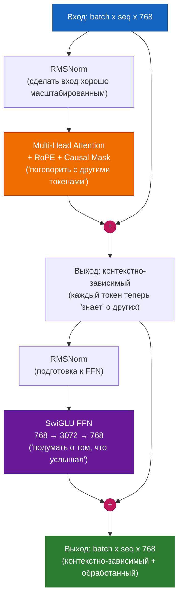

# Глава 6 — Блок трансформера

## Аналогия для пятилетнего ребёнка

Блок трансформера похож на **сэндвич**:

```
RMSNorm         (подготавливает вход — делает его «чистым» и хорошо масштабированным)
  Attention     (основная часть — «поговори со всеми словами и собери контекст»)
  + Residual    (пропускное соединение — «сохрани исходный смысл тоже»)
RMSNorm         (подготавливает снова)
  SwiGLU FFN    («сыр» — «подумай о том, что только что услышал, в одиночку»)
  + Residual    (пропускное соединение — «сохрани то, что было, добавь новое понимание»)
```

Каждая современная большая языковая модель складывает 12–96 таких сэндвичей друг на друга.

## Два подслоя, объяснение

### Подслой 1: Attention — «Поговори со всеми»

```
Вход:  "Кот сидел на коврике"
                            ^
Для токена "коврике": смотрим на "Кот", "сидел", "на", "коврике"
                      Решаем: "сидел" наиболее релевантен (глагол-подлежащее)
                              "на" второй по важности (предлог-существительное)
                      Смешиваем их значения в новое представление "коврика"
```

### Подслой 2: Feed-Forward — «Подумай в одиночку»

```
После attention: каждый токен имеет контекстно-зависимое представление
Теперь FFN: обрабатываем КАЖДЫЙ токен независимо с одинаковыми весами
            (как изучение своих заметок в одиночку после группового обсуждения)

Зачем нужно? Attention смешивает информацию МЕЖДУ токенами.
             FFN обрабатывает информацию ВНУТРИ каждого токена.
             Оба необходимы для глубокого понимания.
```

### Почему Attention не может делать всё?

Частый вопрос: если attention может смотреть на все токены, зачем нам нужен FFN?

**Ответ:** Attention — это ЛИНЕЙНАЯ операция (взвешенная сумма значений). FFN — НЕЛИНЕЙНЫЙ (имеет функции активации). Без FFN укладка большего количества слоёв attention была бы просто большим количеством линейных комбинаций — не более мощной, чем один слой attention. Нелинейность FFN (активация SiLU) — это то, что даёт трансформеру способность универсальной аппроксимации функций.

```
Attention:  output = Σ(attention_weights × values)    ← линейная комбинация
FFN:        output = W3(SiLU(W1 × x) × (W2 × x))     ← нелинейное преобразование
```

## Остаточное соединение — «Градиентная магистраль»

### Что оно делает

```
Без остатка:  output = SubLayer(input)
С остатком:   output = input + SubLayer(Norm(input))
```

### Почему это критично: проблема затухающего градиента

В 12-слойной сети без остатков градиент на слое 1 равен:

```
gradient_at_layer_1 = gradient_at_layer_12 × (weight_12 × weight_11 × ... × weight_2)
```

Если каждый вес равен 0.5 (разумно для начального обучения), то:
```
gradient_at_layer_1 = gradient_at_layer_12 × 0.5^11
                    = gradient_at_layer_12 × 0.0005  ← почти НОЛЬ!
```

Это означает, что ранние слои получают почти никакой сигнал обучения — они остаются случайными, модель никогда не обучается.

**С остатками:**

```
С остатком:  output = input + SubLayer(input)
```

Теперь у градиента есть ДВА пути:
1. Через подслой: `∂(SubLayer) / ∂(input)` — может быть маленьким
2. Через пропуск: `∂(input) / ∂(input) = 1.0` — всегда точно 1.0!

Общий градиент равен `1.0 + small_number` — никогда не затухает.

**Аналогия:** Представьте спуск с 12-го этажа на 1-й. Без остатков вы должны пройти 11 лестничных пролётов (каждый пролёт = умножение на вес). С остатками есть пожарный шест (пропускное соединение), который идёт прямо вниз — градиент течёт мгновенно, независимо от того, что делают подслои.

## Pre-Norm против Post-Norm: критический выбор дизайна

| Аспект | Post-Norm (оригинальная статья) | Pre-Norm (современный) |
|---|---|---|
| Формула | `Norm(x + SubLayer(x))` | `x + SubLayer(Norm(x))` |
| Стабильность обучения | Нестабильно в начале, нужен осторожный LR | Стабильно с шага 1 |
| Поток градиента | Нормализуется ПОСЛЕ сложения | Ненормализованный остаточный путь |
| Используется | Оригинальный Transformer (2017) | GPT-3, LLaMA, PaLM, все современные |
| Глубокие сети | Не работает > 12 слоёв | Работает на 100+ слоях |

**Почему Pre-Norm работает лучше:** Остаточный путь (`+ x`) остаётся ненормализованным, обеспечивая чистый поток градиента. Post-Norm нормализует выход, что может подавлять градиенты в глубоких сетях.

## Современные улучшения

| Компонент | Старый способ | Современный способ | Почему лучше |
|---|---|---|---|
| Нормализация | LayerNorm | **RMSNorm** | На 15% быстрее, одинаково эффективен, не требует центрирования |
| Активация | ReLU/GELU | **SwiGLU** | Механизм ворот учится, какую информацию сохранить/отбросить |
| Позиция Norm | Post-Norm | **Pre-Norm** | Стабильное обучение на любой глубине |

## RMSNorm — подробное объяснение

### LayerNorm против RMSNorm

```
LayerNorm(x) = ((x - mean(x)) / std(x)) * γ + β
               ^^^^^^^^^^^^^^^^^^^^^^^^^^    ^^^^
               центрирование И масштабирование   обучаемый сдвиг и масштаб

RMSNorm(x)  = (x / rms(x)) * γ
               ^^^^^^^^^^^^    ^^
               только масштаб  обучаемый масштаб только (без сдвига, без деления на std)
```

RMSNorm отбрасывает:
1. **Вычитание среднего** (центрирование) — признано ненужным, добавляет вычисления
2. **Параметр смещения β** — признан ненужным, остаточное соединение справляется с этим
3. **Стандартное отклонение** — использует RMS вместо (квадратный корень из среднего квадратов, проще вычислить)

Результат: математически проще, ~15% быстрее, такая же производительность на практике.

### Зачем вообще нормализовать?

Без нормализации выходы attention и FFN могут расти неограниченно. После 12 слоёв значения могут быть в 100 раз больше или в 0.01 раза меньше их исходной величины — вызывая численную нестабильность. Нормализация поддерживает выход каждого слоя на согласованном масштабе.

## Код RMSNorm

```python
import torch
import torch.nn as nn


class RMSNorm(nn.Module):
    """
    ЧТО: Root Mean Square Layer Normalization.
    ЗАЧЕМ: Нормализует представление каждого токена, чтобы его величина была ~1.0.
         Предотвращает рост/уменьшение значений в глубоких сетях.

         Используется в: LLaMA 1/2/3, Mistral, Gemma, Qwen
    """

    def __init__(self, d_model: int, eps: float = 1e-6):
        super().__init__()
        # ЧТО: Обучаемый масштаб на размерность
        # ЗАЧЕМ: После принудительного RMS=1 модель может научиться усиливать
        #      важные размерности и ослаблять неважные.
        #      Начинается с 1.0 (изначально без изменений).
        self.weight = nn.Parameter(torch.ones(d_model))
        self.eps = eps  # ЗАЧЕМ: предотвращает деление на ноль

    def forward(self, x: torch.Tensor) -> torch.Tensor:
        # ЧТО: Вычисляет 1/sqrt(mean(x²))
        # ЗАЧЕМ: rsqrt это 1/sqrt — вычисляется как одно CUDA-ядро
        #      для скорости. Среднее берётся по последней размерности (d_model).
        #      keepdim=True сохраняет размерность для broadcasting.
        rms = torch.rsqrt(x.pow(2).mean(-1, keepdim=True) + self.eps)

        # ЧТО: Нормализовать, затем обучаемое масштабирование
        return x * rms * self.weight
```

## Код SwiGLU

```python
import torch
import torch.nn as nn
import torch.nn.functional as F


class SwiGLU(nn.Module):
    """
    ЧТО: SwiGLU — гейтированная версия активации Swish.
    ЗАЧЕМ: «Ворота» (правая часть умножения) учатся избирательно
         пропускать или блокировать информацию — как кран.

         Стандартный FFN:  output = W2(ReLU(W1(x)))
         SwiGLU FFN:       output = W3(SiLU(W1(x)) * (W2(x)))
                                   ^^^^^^^^      ^^^^^^
                                   значения      ворота

         Ворота умножают значения: если ворота ≈ 0, блокировать инфо.
                                     если ворота ≈ 1, пропустить инфо.
                                     если ворота ≈ 0.5, частичный пропуск.

         Этот механизм гейтирования — то, что делает SwiGLU лучше
         ReLU и GELU — модель учится, ГДЕ применять нелинейность.

         Статья: "GLU Variants Improve Transformer" (Shazeer, 2020)
         Используется в: LLaMA 1/2/3, PaLM, Gemini
    """

    def __init__(self, d_model: int, expansion_factor: int = 4):
        super().__init__()

        # ЧТО: Скрытая размерность в 4 раза больше входа/выхода — «расширяющее» узкое место
        # ЗАЧЕМ: Расширить→обработать→сжать более выразительно, чем тот же размер.
        #      784 → 3072 → 784 позволяет FFN изучать ~в 4 раза более сложные паттерны.
        hidden_dim = expansion_factor * d_model

        self.w1 = nn.Linear(d_model, hidden_dim, bias=False)   # Проецирует в значения
        self.w2 = nn.Linear(d_model, hidden_dim, bias=False)   # Проецирует в ворота
        self.w3 = nn.Linear(hidden_dim, d_model, bias=False)   # Проецирует обратно

    def forward(self, x: torch.Tensor) -> torch.Tensor:
        # ЧТО: SiLU(w1(x)) — значения, w2(x) — ворота
        # ЗАЧЕМ: SiLU (также называется Swish) = x * sigmoid(x)
        #      Она гладкая (в отличие от ReLU, у которой острый угол при 0),
        #      что улучшает поток градиентов во время обучения.
        #      Ворота поэлементно умножают значения, избирательно пропуская инфо.
        return self.w3(F.silu(self.w1(x)) * self.w2(x))
```

## Полный код блока трансформера

```python
import torch
import torch.nn as nn


class TransformerBlock(nn.Module):
    """
    ЧТО: Один полный слой трансформера (attention + FFN с остатками).
    ЗАЧЕМ: Сложить N таких слоёв для построения глубокой языковой модели.

         Архитектура (Pre-Norm):
         ┌─────────────────────────────────────┐
         │ x = x + Attention(RMSNorm(x), mask) │  ← Смешивание информации МЕЖДУ токенами
         │ x = x + SwiGLU(RMSNorm(x))          │  ← Обработка информации ВНУТРИ токенов
         └─────────────────────────────────────┘

         Каждый подслой: нормализовать СНАЧАЛА (pre-norm), затем вычислить,
         затем ДОБАВИТЬ обратно оригинал (остаточное соединение).

         Без остатков: глубокие сети не могут обучаться (затухающие градиенты)
         Без pre-norm: обучение нестабильно на больших глубинах
         Без FFN: нет нелинейной обработки на токен
         Без attention: нет смешивания информации между токенами
    """

    def __init__(self, d_model: int, num_heads: int, dropout: float = 0.1):
        super().__init__()

        # ЧТО: Первая нормализация — перед attention
        # ЗАЧЕМ: Pre-norm: чистый, хорошо масштабированный вход → стабильное вычисление attention
        self.norm1 = RMSNorm(d_model)

        # ЧТО: Multi-head self-attention с RoPE и каузальной маской
        # ЗАЧЕМ: Основной механизм, позволяющий токенам «говорить» друг с другом
        self.attention = MultiHeadAttention(d_model, num_heads, dropout)

        # ЧТО: Вторая нормализация — перед FFN
        # ЗАЧЕМ: FFN ожидает нормализованный вход для согласованного поведения across слоёв
        self.norm2 = RMSNorm(d_model)

        # ЧТО: SwiGLU feed-forward сеть
        # ЗАЧЕМ: Нелинейная обработка на токен. Без этого укладка большего количества
        #      слоёв attention была бы не более мощной, чем один слой.
        self.ffn = SwiGLU(d_model)

    def forward(self, x: torch.Tensor, mask: torch.Tensor = None) -> torch.Tensor:
        """
        Прямой проход: norm → подслой → добавить остаток.
        Выполняется дважды: один раз для attention, один раз для FFN.
        """

        # ===== ПОДСЛОЙ 1: Self-Attention с остатком =====
        # ЧТО: x = x + Attention(Norm(x))
        # ЗАЧЕМ: Модель учит, какие ИЗМЕНЕНИЯ (дельта) внести в x,
        #      а не чем полностью заменить x. Это легче выучить.
        #      Если attention не может улучшить, он может выдать около нуля.
        x = x + self.attention(self.norm1(x), mask)

        # ===== ПОДСЛОЙ 2: Feed-Forward с остатком =====
        # ЧТО: x = x + FFN(Norm(x))
        # ЗАЧЕМ: Тот же паттерн остатка. После смешивания информации через attention,
        #      каждый токен «думает» независимо через FFN.
        #      Attention = групповое обсуждение. FFN = личное размышление.
        x = x + self.ffn(self.norm2(x))

        return x
```

## Диаграмма архитектуры



---

**Предыдущая:** [Глава 5 — Attention](05_attention.md)  
**Следующая:** [Глава 7 — Полная модель GPT](07_gpt_model.md)
