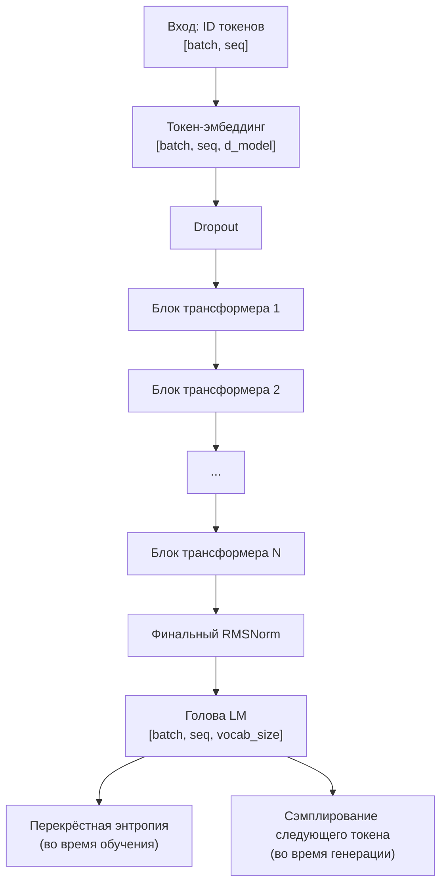

# Глава 7 — Полная модель GPT

## Что мы строим

После 6 глав с отдельными компонентами, мы теперь собираем их в **полную языковую модель**. Это по сути та же архитектура, что и у LLaMA 3, Mistral и Qwen 2.5 — уменьшенная версия, которая поместится на вашем GPU.



## Конфигурация — «рецепт» вашей модели

```python
from dataclasses import dataclass


@dataclass
class GPTConfig:
    """
    WHAT: Все гиперпараметры в одном месте.
    WHY: Изменение размера модели — одна строка. Не нужно искать по всему коду.
    """
    # ===== Архитектура =====
    vocab_size: int = 50257        # WHAT: 50 257 уникальных токенов в словаре GPT-2
    d_model: int = 768             # WHAT: Каждый токен становится вектором размерности 768
                                   # WHY: Больше = более нюансированные значения, больше вычислений
    num_heads: int = 12            # WHAT: 12 голов внимания (12 × 64 = 768)
    num_layers: int = 12           # WHAT: 12 блоков трансформера, расположенных друг над другом
                                   # WHY: Глубже = лучше рассуждения, сложнее обучать
    max_seq_len: int = 1024        # WHAT: Максимальное количество токенов, которое модель может обработать за один раз

    # ===== Регуляризация (предотвращение переобучения) =====
    dropout: float = 0.1           # WHAT: Случайно отключать 10% нейронов во время обучения
    embd_dropout: float = 0.1      # WHAT: Dropout применяется сразу после поиска эмбеддинга

    # ===== Обучение =====
    learning_rate: float = 3e-4    # WHAT: Размер шага для обновления весов
    weight_decay: float = 0.1      # WHAT: Штрафовать большие веса (L2-регуляризация)
    warmup_steps: int = 2000       # WHAT: Постепенно увеличивать LR в течение первых 2000 шагов
    max_steps: int = 100000        # WHAT: Общее количество итераций обучения
    batch_size: int = 8            # WHAT: Последовательностей, обрабатываемых за шаг GPU
    grad_accum_steps: int = 4      # WHAT: Накопление градиентов (эффективный батч = 8×4 = 32)
    betas: tuple = (0.9, 0.95)    # WHAT: Коэффициенты момента AdamW
    eps: float = 1e-8              # WHAT: Малая константа для предотвращения деления на ноль

    def __post_init__(self):
        """Проверка согласованности конфигурации."""
        assert self.d_model % self.num_heads == 0, (
            f"d_model ({self.d_model}) должен делиться на "
            f"num_heads ({self.num_heads}) без остатка"
        )
```

## Полная модель GPT

```python
import torch
import torch.nn as nn
import torch.nn.functional as F


class GPT(nn.Module):
    """
    WHAT: Полная языковая модель Transformer только с декодером.
    WHY: Этот единственный класс объединяет всё, что мы построили:
         эмбеддинг → N× блоков трансформера → проекция вывода.

         «Только декодер» означает, что она генерирует текст слева направо
         (каузальная/авторегрессионная), без кодировщика, который бы
         просматривал всю последовательность целиком.

         Это то же семейство архитектур, что и:
         GPT-2 (12 слоёв, 768 размерностей), GPT-3 (96 слоёв, 12288 размерностей),
         LLaMA 3 (32–80 слоёв), Mistral (32 слоя)
    """

    def __init__(self, config: GPTConfig):
        super().__init__()
        self.config = config

        # ===== 1. ТОКЕН-ЭМБЕДДИНГ =====
        # WHAT: Таблица поиска: ID токена → плотный вектор
        # WHY: Преобразует целые числа (ID) в непрерывные векторы,
        #      с которыми могут работать нейронные сети.
        #      Форма: [50257, 768] — одна строка на токен словаря
        self.token_embedding = nn.Embedding(config.vocab_size, config.d_model)

        # WHAT: Dropout, применяемый к эмбеддингам
        # WHY: Ранний dropout предотвращает переобучение модели на
        #      конкретных значениях эмбеддингов во время обучения
        self.embd_dropout = nn.Dropout(config.embd_dropout)

        # ===== 2. БЛОКИ ТРАНСФОРМЕРА =====
        # WHAT: Стопка из N идентичных слоёв трансформера
        # WHY: nn.ModuleList регистрирует каждый блок, чтобы PyTorch отслеживал
        #      их параметры для обучения. Обычный список Python НЕ отслеживался бы!
        #
        #      Каждый блок: RMSNorm → Attention(+остаточное) → RMSNorm → FFN(+остаточное)
        self.layers = nn.ModuleList([
            TransformerBlock(
                d_model=config.d_model,
                num_heads=config.num_heads,
                dropout=config.dropout
            )
            for _ in range(config.num_layers)
        ])

        # ===== 3. ФИНАЛЬНАЯ НОРМАЛИЗАЦИЯ =====
        # WHAT: Последний RMSNorm перед выходной головой
        # WHY: Выход последнего блока трансформера — сырой (ненормализованный).
        #      Мы нормализуем перед проекцией в словарь, чтобы
        #      голова LM получила чистые, хорошо масштабированные входы.
        self.final_norm = RMSNorm(config.d_model)

        # ===== 4. ГОЛОВА LM (проекция вывода) =====
        # WHAT: Линейная проекция: d_model → vocab_size
        # WHY: Преобразует 768-мерное «понимание» каждого токена
        #      в 50257-мерный вектор оценок — по одной оценке на
        #      каждый возможный следующий токен.
        #
        #      logits[b, t, v] = «оценка того, что токен v будет следующим
        #                         словом после позиции t в батче b»
        self.lm_head = nn.Linear(config.d_model, config.vocab_size, bias=False)

        # ===== 5. СВЯЗЫВАНИЕ ВЕСОВ =====
        # WHAT: Разделить матрицу весов между эмбеддингом и головой LM
        # WHY: Эмбеддинг отображает токен → вектор. Голова LM отображает
        #      вектор → токен. Это ОБРАТНЫЕ операции!
        #
        #      Разделение весов даёт три преимущества:
        #      1. Эффективность параметров: экономия 50257×768 = 38,6 млн параметров
        #         (30% от общего количества для малой GPT-2!)
        #      2. Лучшая регуляризация: общая матрица получает
        #         градиентные сигналы с обоих направлений, улучшая
        #         качество представлений токенов
        #      3. Теоретическая элегантность: входные и выходные токены
        #         живут в одном семантическом пространстве
        #
        #      Как это работает: установка self.lm_head.weight так, чтобы она указывала на
        #      ТОТ ЖЕ самый тензор, что и self.token_embedding.weight, означает,
        #      что PyTorch использует одну и ту же память для обоих.
        self.token_embedding.weight = self.lm_head.weight

        # ===== 6. ИНИЦИАЛИЗАЦИЯ ВЕСОВ =====
        # WHAT: Инициализировать все веса распределением Normal(0, 0.02)
        # WHY: Начало с правильного распределения критически важно.
        #      Слишком мало → градиенты затухают, модель никогда не учится.
        #      Слишком много → активации насыщаются, градиенты взрываются.
        #      Стандартное отклонение 0.02 даёт значения в основном в диапазоне [-0.04, 0.04],
        #      что является оптимальным для Transformers.
        self.apply(self._init_weights)
        print(f"GPT инициализирована с {self.get_num_params():,} параметрами")

    def _init_weights(self, module: nn.Module):
        """Инициализация весов по схеме GPT-2."""
        if isinstance(module, nn.Linear):
            torch.nn.init.normal_(module.weight, mean=0.0, std=0.02)
            if module.bias is not None:
                torch.nn.init.zeros_(module.bias)
        elif isinstance(module, nn.Embedding):
            torch.nn.init.normal_(module.weight, mean=0.0, std=0.02)

    def get_num_params(self) -> int:
        """Подсчитать общее количество обучаемых параметров (весов + смещений)."""
        return sum(p.numel() for p in self.parameters())

    def forward(
        self,
        input_ids: torch.Tensor,
        targets: torch.Tensor = None
    ) -> tuple:
        """
        WHAT: Обработать батч последовательностей токенов через модель GPT.

        Args:
            input_ids: [batch_size, seq_len] — ID токенов для каждой последовательности
            targets:   [batch_size, seq_len] — те же токены, используются для потерь
                       (модель предсказывает input_ids[t+1] по input_ids[t])

        Returns:
            logits: [batch, seq_len, vocab_size] — сырые оценки предсказаний
            loss:   скаляр — перекрёстная энтропия (None, если targets не предоставлены)

        Трюк со сдвигом на единицу:
            Вход:   [The,  cat,  sat,  on,   the,  mat]
                     ↓     ↓     ↓     ↓     ↓     ↓
            Цель:   [cat,  sat,  on,   the,  mat,  ?]
            Предсказание: P(cat|The) P(sat|The,cat) ... P(mat|The,cat,sat,on,the)

Набор данных уже предоставляет сдвинутые цели, поэтому мы вычисляем потери по всем позициям.
        """
        batch_size, seq_len = input_ids.shape

        # ===== 1. ЭМБЕДДИНГ ТОКЕНОВ =====
        # Вход:  [batch, seq] ID токенов
        # Выход: [batch, seq, d_model] непрерывные векторы
        x = self.token_embedding(input_ids)
        x = self.embd_dropout(x)

        # ===== 2. СОЗДАНИЕ КАУЗАЛЬНОЙ МАСКИ =====
        # WHAT: Нижнетреугольная маска: токен i может видеть только токены 0..i
        # WHY: Без этого модель могла бы «жульничать», заглядывая в
        #      будущие токены при предсказании следующего.
        mask = create_causal_mask(seq_len, input_ids.device)

        # ===== 3. СЛОИ ТРАНСФОРМЕРА =====
        # WHAT: Последовательно пройти через все N блоков трансформера
        # WHY: Каждый слой уточняет представления. Ранние слои
        #      захватывают синтаксис. Поздние слои захватывают семантику.
        for layer in self.layers:
            x = layer(x, mask)

        # ===== 4. ФИНАЛЬНАЯ НОРМАЛИЗАЦИЯ =====
        x = self.final_norm(x)

        # ===== 5. ПРОЕКЦИЯ В СЛОВАРЬ =====
        # WHAT: Преобразовать из d_model-мерного «понимания» в scores размерности vocab_size
        # WHY: Каждая позиция получает оценку для каждого возможного следующего токена.
        #
        # Пример: logits[0, 3, 2603] = 9.2 означает:
        #   «Для батча 0, позиции 3 оценка токена 2603 ('mat') равна 9.2»
        #   Более высокая оценка = модель считает этот токен более вероятным.
        logits = self.lm_head(x)  # [batch, seq_len, vocab_size]

        # ===== 6. ВЫЧИСЛЕНИЕ ПОТЕРЬ (только для обучения) =====
        loss = None
        if targets is not None:
            # WHAT: Согласовать предсказания с целями, используя сдвиг на единицу
            #
            # logits[:, :-1, :]:  предсказания для позиций 0..seq-2
            # targets[:, 1:]:      истинные токены для позиций 1..seq-1
            #
            #          Позиция:   0      1      2      3
            #          Вход:      The    cat    sat    on
            #          Цель:      cat    sat    on     the
            #          Logits:   P(cat) P(sat) P(on)  P(the)
            #                                        ^
            #                                   Мы отбрасываем это
            #                                   (нет цели для него)
            logits_flat = logits.contiguous().view(
                -1, self.config.vocab_size
            )
            targets_flat = targets.contiguous().view(
                -1
            )
            loss = F.cross_entropy(logits_flat, targets_flat)

        return logits, loss

    @torch.no_grad()
    def generate(
        self,
        input_ids: torch.Tensor,
        max_new_tokens: int,
        temperature: float = 1.0,
        top_k: int = 50,
        top_p: float = 0.95,
    ) -> torch.Tensor:
        """
        WHAT: Авторегрессионная генерация новых токенов.
        WHY: Во время инференса у нас нет целей — мы генерируем
             по одному токену за раз и используем результат как вход для следующего шага.

        Args:
            input_ids: [batch, seq] — начальный промпт (ID токенов)
            max_new_tokens: сколько новых токенов сгенерировать
            temperature: температура сэмплирования (0.0 = greedy, >1.0 = случайно)
            top_k: топ-K сэмплирование (0 = отключено)
            top_p: топ-P (nucleus) сэмплирование (1.0 = отключено)

        Returns:
            [batch, seq + max_new_tokens] — исходный промпт + сгенерированные токены
        """
        model.eval()
        for _ in range(max_new_tokens):
            # ===== FORWARD PASS =====
            # WHAT: Получить logits для всех позиций
            logits, _ = self(input_ids)

            # ===== ИЗВЛЕЧЬ LOGITS ДЛЯ ПОСЛЕДНЕЙ ПОЗИЦИИ =====
            # WHAT: Нам нужно только предсказание для следующего токена
            logits = logits[:, -1, :]  # [batch, vocab_size]

            # ===== ПРИМЕНИТЬ ТЕМПЕРАТУРУ =====
            # WHAT: Масштабировать logits перед softmax
            # WHY: Низкая температура → резкое распределение (уверенные выборы)
            #      Высокая температура → плоское распределение (случайные выборы)
            if temperature > 0:
                logits = logits / temperature

            # ===== TOP-K САМПЛИРОВАНИЕ =====
            # WHAT: Сохранить только K наиболее вероятных токенов
            # WHY: Отфильтровать очевидный мусор, сохраняя разнообразие
            if top_k > 0:
                indices_to_remove = logits < torch.topk(logits, top_k)[0][..., -1, None]
                logits[indices_to_remove] = float('-inf')

            # ===== TOP-P (NUCLEUS) САМПЛИРОВАНИЕ =====
            # WHAT: Сохранить наименьшее множество токенов с суммарной вероятностью > P
            # WHY: Адаптируется к уверенности модели:
            #      Уверенная → мало токенов, Неуверенная → много токенов
            if top_p < 1.0:
                sorted_logits, sorted_indices = torch.sort(logits, descending=True)
                cumulative_probs = torch.cumsum(
                    F.softmax(sorted_logits, dim=-1), dim=-1
                )
                # Удалить токены после превышения cumulative probability > top_p
                sorted_indices_to_remove = cumulative_probs > top_p
                # Сдвиг вправо: всегда сохранять первый токен
                sorted_indices_to_remove[:, 1:] = (
                    sorted_indices_to_remove[:, :-1].clone()
                )
                sorted_indices_to_remove[:, 0] = False
                # Вернуть обратно в исходный порядок
                indices_to_remove = sorted_indices_to_remove.scatter(
                    1, sorted_indices, sorted_indices_to_remove
                )
                logits[indices_to_remove] = float('-inf')

            # ===== СЭМПЛИРОВАТЬ СЛЕДУЮЩИЙ ТОКЕН =====
            # WHAT: Преобразовать logits → вероятности → выбрать один токен
            probs = F.softmax(logits, dim=-1)
            next_token = torch.multinomial(probs, num_samples=1)

            # ===== ДОБАВИТЬ К ПОСЛЕДОВАТЕЛЬНОСТИ =====
            input_ids = torch.cat([input_ids, next_token], dim=1)

        return input_ids
```

## nn.Parameter vs register_buffer vs обычный атрибут

Это распространённая путаница. Вот окончательное руководство:

| Тип | Создаётся через | Отслеживается оптимизатором? | Сохраняется в state_dict? | Перемещается через .to(device)? |
|---|---|---|---|---|
| `nn.Parameter` | `nn.Parameter(tensor)` | Да | Да | Да |
| `register_buffer` | `self.register_buffer("name", t)` | Нет | Да | Да |
| Обычный атрибут | `self.x = tensor` | Нет | Нет | Нет |

Наша модель использует:
- **nn.Parameter**: Все веса (nn.Linear, nn.Embedding создают их автоматически)
- **register_buffer**: cos/sin кэши RoPE (не обучаются, но должны перемещаться на GPU)
- **Обычный**: объект config (не тензор, не нуждается в GPU)

## Как на самом деле выглядят Logits

```python
# После forward pass, logits имеют форму [batch=1, seq=6, vocab=50257]:
logits[0, 5, :]  # Предсказания для позиции 5 (предсказание токена 6)
# = массив из 50257 чисел вида:
# [0.1, -0.3, 0.7, ..., 9.2, ..., -2.1]
#  ^^^^  ^^^^  ^^^^       ^^^^       ^^^^
#  "the" "a"   "an"       "mat"      "xyzzy"

# После softmax: вероятности, суммирующиеся в 1.0
probs = softmax(logits[0, 5, :])
# [0.0001, 0.0001, 0.0003, ..., 0.45, ..., 0.0000]
#                              ^^^^
#                          "mat" имеет вероятность 45%

# Топ-5 предсказаний модели для позиции 5:
top5_indices = torch.topk(logits[0, 5, :], 5).indices
# → [2603, 4521, 1234, 8901, 345]  (ID токенов)
# → ["mat", "rug", "floor", "table", "chair"]
```

---

**Предыдущая:** [Глава 6 — Блок трансформера](06_transformer_block.md)  
**Следующая:** [Глава 8 — Конвейер обучения](08_training.md)
